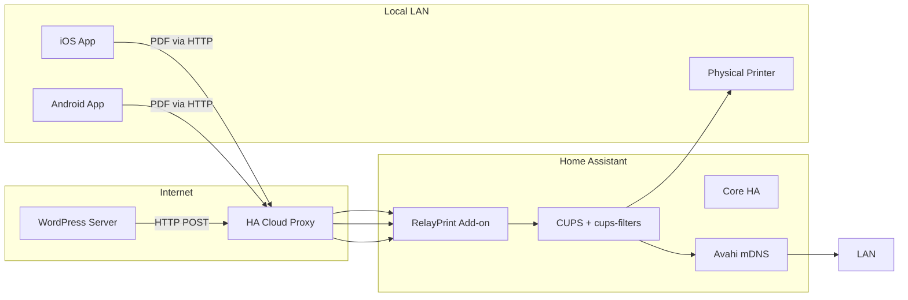
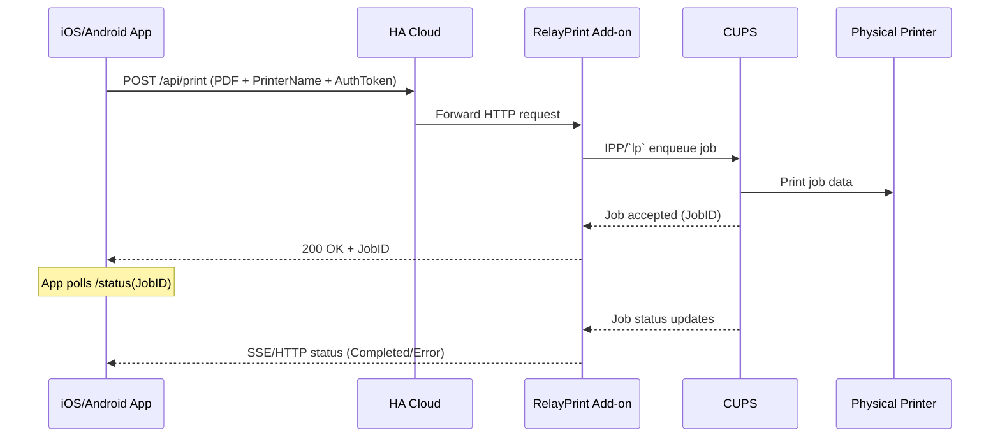

# Product Requirements Document (PRD)

## Project Name: RelayPrint (working title)

## 1. Purpose and Scope

**Purpose:** Replace Google Cloud Print with an open-source Home Assistant add-on that exposes local printers (via CUPS/IPP) to remote clients using secure tunnels, and companion mobile apps that emulate printers on iOS/Android to relay print jobs.

**Scope:**

- Home Assistant add-on („RelayPrint“) packaging CUPS + Avahi for local AirPrint and IPP Everywhere.
- Secure remote access via Home Assistant Cloud ingress or direct IPPS endpoint.
- Companion mobile apps (iOS & Android) registering as virtual printers.
- WordPress plugin or REST API endpoint for automated web-to-print workflows.

## 2. Objectives & Success Metrics

| Objective                            | Success Metric                                            |
| ------------------------------------ | --------------------------------------------------------- |
| Local AirPrint & IPP printing on LAN | Print test page from iOS/macOS/Windows/Linux locally      |
| Secure remote printing               | Print test page remotely via Home Assistant Cloud or IPPS |
| Mobile app usability                 | < 3 steps to print from iOS/Android after initial setup   |
| Automated web-to-print               | WooCommerce order prints automatically within 5 seconds   |
| Security & Privacy                   | All traffic encrypted (TLS), no open unauth’d ports       |

## 3. User Stories

- **US1:** As a Home Assistant user, I can discover and print to my USB/network printer from any device on my LAN.
- **US2:** As a mobile user, I can “print” from my iPhone/Android phone while away from home, and my print job is relayed to my home printer.
- **US3:** As a store owner, when an order is placed on my WordPress site, a label prints automatically on my local label printer.
- **US4:** As a system administrator, I can restrict which printers are exposed remotely and manage access tokens.

## 4. Functional Requirements

1. **Local Printer Discovery & Sharing**
   - Package CUPS with `cups-filters` on Alpine Linux.
   - Install and configure Avahi to advertise `_ipp._tcp` / `_ipps._tcp` for AirPrint with correct TXT records (e.g., `URF`).
2. **Remote Print Access**
   - Expose an IPPS endpoint via Home Assistant Cloud ingress or direct port (631) with TLS.
   - Authenticate remote requests via long-lived Home Assistant tokens or dedicated print API keys.
3. **Companion Mobile Apps**
   - **iOS App:** Register as an AirPrint printer via Bonjour; capture PDF jobs; POST to print API.
   - **Android App:** Implement `PrintService`; capture print jobs; POST to print API.
4. **Web-to-Print API**
   - Expose REST endpoint (`/api/print`) accepting `POST` with PDF (or image) + metadata (`printer_name`).
   - Validate authentication; enqueue job to CUPS via IPP or `lp` command.
5. **Printer Management**
   - Provide CUPS Web UI via Home Assistant ingress for adding/removing printers and PPDs.
6. **Job Status Feedback**
   - Mobile apps poll or subscribe to job status; Home Assistant add-on exposes printer/job state via an API or SSE.

## 5. Non-Functional Requirements

- **Open Source:** All components under OSI-approved licenses.
- **Compatibility:** Support Home Assistant OS (armv7, arm64, amd64).
- **Performance:** Handle up to 10 concurrent print jobs; minimal CPU/RAM (<150 MB RAM).
- **Security:** All endpoints over TLS; require authenticated access; store credentials securely.
- **Persistence:** Persist CUPS config and spool across add-on restarts.
- **Usability:** Zero CLI—everything configurable via Home Assistant UI where possible.

## 6. Architecture Overview

## 7. Sequence Diagram for Mobile Print Flow

## 8. API Specification

### POST /api/print

- **Description:** Submit a print job.
- **Authentication:** Bearer token (Home Assistant Long-Lived Token or API key).
- **Parameters:**
  - `file`: multipart/form-data PDF/image (required)
  - `printer_name`: string (required)
  - `options`: JSON (optional, e.g., copies, duplex)
- **Response:**
  - `200 OK` `{ job_id: string }`
  - `4xx` on error (authentication, missing params)

### GET /api/print/\:job\_id/status

- **Description:** Retrieve status of a print job.
- **Response:**
  - `200 OK` `{ job_id: string, status: "queued"|"printing"|"completed"|"error", message?: string }`

## 9. Security Considerations

- Enforce TLS for all external endpoints.
- Limit remote access to authenticated clients only.
- Optionally restrict API keys to specific printers.
- Do not expose CUPS admin UI externally—only via authenticated Home Assistant ingress.

## 10. Acceptance Criteria

1. **Local Print Test:** User can discover and print from LAN device without additional drivers.
2. **Remote Print Test:** User can print a test page from a remote device via HA Cloud (iOS app, Android app, macOS manual IPPS).
3. **Web-to-Print Test:** WooCommerce order triggers a POST to `/api/print`, resulting in a printed label.
4. **Security Test:** All endpoints require valid token; no unauthenticated printing possible.
5. **Persistence Test:** After rebooting Home Assistant, printers and pending jobs persist.

---

*End of PRD.md*

